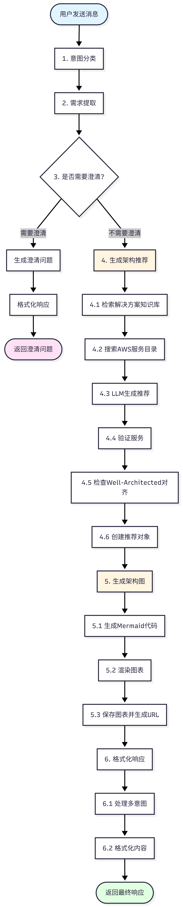
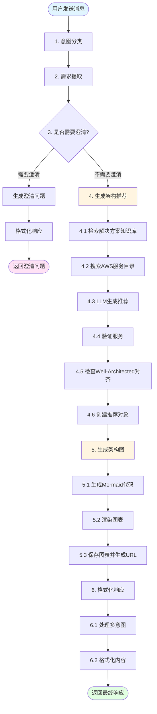
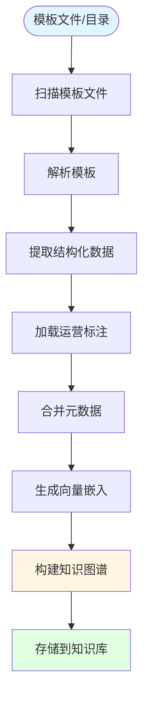

# 架构图推荐流程

本文档详细描述了AWS架构图推荐的完整逻辑流程。

## 整体流程图




## 详细流程说明

### 1. 意图分类 (Classify Intents)

**节点**: `classify_intents_node`

**功能**: 识别用户消息中的多个意图

**实现**:
- 使用 `MultiIntentClassifier` 对用户消息进行分类
- 识别意图类型（如：推荐、修改、定价、澄清等）
- 返回识别到的意图列表

**输出**: `state.recognized_intents`

---

### 2. 需求提取 (Extract Requirements)

**节点**: `extract_requirements_node`

**功能**: 从用户消息中提取结构化需求

**实现**:
- 使用 `RequirementExtractor` 调用LLM提取需求
- 提取的需求类型包括：
  - `application_type`: 应用类型（Web应用、移动应用、数据分析等）
  - `scale`: 规模要求（用户数量、数据量、请求量等）
  - `constraint`: 约束条件（高可用性、安全性、成本优化等）
  - `preference`: 用户偏好（区域、服务类型等）
- 与之前的需求合并，避免重复
- 更新会话上下文

**输出**: `state.extracted_requirements`

---

### 3. 需求澄清 (Clarify Requirements)

**节点**: `clarify_requirements_node`

**功能**: 判断是否需要澄清，并生成澄清问题

**决策逻辑**:
1. 检查是否有澄清意图
2. 使用 `KBClarificationService` 分析需求完整性
3. 检查澄清轮次是否超过上限（最多2轮）

**澄清问题生成**:
- 检查缺失的核心需求类型
- 从解决方案知识库检索候选模板
- 基于候选模板差异生成区分性问题
- 生成默认假设说明

**输出**:
- 如果需要澄清: `state.requires_clarification = True`, `state.clarification_questions`
- 如果不需要澄清: 继续下一步

---

### 4. 生成架构推荐 (Generate Recommendation)

**节点**: `generate_recommendation_node`

**功能**: 基于需求生成AWS架构推荐

#### 4.1 检索解决方案知识库

**实现**: `SolutionTemplateRetriever.retrieve()`
- 基于需求进行语义检索
- 返回最相关的成熟解决方案模板（最多3个）
- 作为LLM推荐的强先验知识

#### 4.2 搜索AWS服务目录

**实现**: `AWSServiceCatalog.search_services()`
- 如果启用RAG: 使用语义搜索找到最相关的服务（top_k=10）
- 否则: 使用关键词搜索或返回所有服务的前20个
- 构建可用服务列表供LLM参考

#### 4.3 LLM生成推荐

**实现**: `ArchitectureRecommender._get_service_recommendations()`

**Prompt构建**:
- 包含用户需求
- 包含检索到的成熟模板候选（如匹配请优先复用）
- 包含可用AWS服务列表
- 要求返回JSON格式，包括：
  - 服务列表（名称、类型、角色、数量、区域）
  - 每个服务的配置（实例类型、存储、规格等）
  - 架构说明

**LLM调用**:
- 支持OpenAI、Anthropic、Groq三种提供商
- 使用JSON格式输出
- Temperature: 0.5

#### 4.4 验证服务

**实现**: `AWSServiceValidator`
- 验证服务名称是否有效
- 验证服务类型是否正确
- 验证配置参数是否合理

#### 4.5 检查Well-Architected对齐

**实现**: `WellArchitectedChecker.check_alignment()`
- 检查架构是否符合AWS Well-Architected Framework六大支柱：
  - Operational Excellence（运营卓越）
  - Security（安全性）
  - Reliability（可靠性）
  - Performance Efficiency（性能效率）
  - Cost Optimization（成本优化）
  - Sustainability（可持续性）

#### 4.6 创建推荐对象

**实现**: 创建 `ArchitectureRecommendation` 对象
- 包含服务列表 (`services`)
- 包含配置列表 (`configurations`)
- 包含Well-Architected对齐信息
- 包含推荐说明 (`explanation`)

**输出**: `state.current_recommendation`

---

### 5. 生成架构图 (Generate Diagram)

**节点**: `generate_diagram_node`

**功能**: 为推荐生成可视化架构图

#### 5.1 生成Mermaid代码

**实现**: `DiagramGenerator.generate_mermaid()`

**流程图生成逻辑**:
- 为每个服务创建节点
- 节点标签包含：服务名称、角色、数量、关键配置
- 根据服务依赖关系创建边
- 如果没有显式依赖，创建顺序流

**节点格式**:
```
节点ID["服务名称\\n角色\\n数量: X\\n实例: t3.medium | 存储: 30GB"]
```

#### 5.2 渲染图表

**实现**: `DiagramRenderer.render_svg()`
- 将Mermaid代码渲染为SVG格式

#### 5.3 保存图表并生成URL

**实现**: `DiagramStorage.save_diagram()`
- 保存SVG文件到 `./diagrams/` 目录
- 文件名使用推荐ID: `{recommendation_id}.svg`
- 生成访问URL: `/diagrams/{recommendation_id}.svg`

**输出**: 
- `state.current_recommendation.diagram_data` (Mermaid源码)
- `state.current_recommendation.diagram_url` (图表URL)

---

### 6. 格式化响应 (Format Response)

**节点**: `format_response_node`

**功能**: 格式化最终响应内容

#### 6.1 处理多意图

**实现**: `IntentOrchestrator.process_intents()`
- 按优先级处理多个意图
- 为每个意图生成处理结果

#### 6.2 格式化内容

**实现**: `MultiIntentResponseFormatter.format_response()`

**响应内容包含**:
- 推荐的服务列表（带数量和配置）
- 架构说明
- 架构图链接
- 多意图处理结果（如果有）

**示例响应格式**:
```markdown
根据您的需求，我为您推荐以下AWS架构方案：

**推荐的服务：**
- **EC2**: Web服务器 (数量: 2) | 实例类型: t3.medium, 存储: 30GB
- **RDS**: 数据库 | 数据库规格: db.t3.medium, 存储: 100GB

**架构说明：**
推荐使用EC2作为Web服务器，因为...

**架构图：**
架构图已生成，可通过以下链接查看：/diagrams/{recommendation_id}.svg
```

**输出**: `state.response_content`

---

## 数据流

### 状态对象 (AgentState)

在整个流程中，状态对象在各节点间传递：

```python
{
    "session_id": UUID,
    "current_message": str,
    "conversation_history": List[Dict],
    "recognized_intents": List[Intent],
    "extracted_requirements": List[UserRequirement],
    "requires_clarification": bool,
    "clarification_questions": List[str],
    "clarification_rounds_used": int,
    "current_recommendation": ArchitectureRecommendation,
    "response_content": str,
    "processing_complete": bool,
    "warnings": List[str],
}
```

### 关键模型

#### ArchitectureRecommendation
```python
{
    "recommendation_id": UUID,
    "session_id": UUID,
    "services": List[Service],
    "configurations": List[Configuration],
    "diagram_data": str,  # Mermaid源码
    "diagram_url": str,   # 图表URL
    "well_architected_alignment": Dict,
    "explanation": str,
}
```

#### Service
```python
{
    "service_id": UUID,
    "recommendation_id": UUID,
    "aws_service_name": str,
    "service_type": ServiceType,
    "role": str,
    "region": str,
    "quantity": int,
    "dependencies": List[UUID],
}
```

#### Configuration
```python
{
    "service_id": UUID,
    "config_type": str,  # instance_type, storage, db_instance_class等
    "config_value": str,
    "config_details": Dict,
}
```

---

## 关键特性

### 1. 解决方案知识库集成
- 从成熟解决方案模板中检索相关架构
- 优先复用模板的资源组合和参数习惯
- 提高推荐的准确性和最佳实践对齐

### 2. 智能澄清机制
- 基于知识库候选模板差异生成区分性问题
- 最多2轮澄清，避免过度询问
- 提供默认假设，允许用户跳过细节

### 3. 多意图支持
- 支持同时处理多个用户意图
- 按优先级顺序处理
- 统一格式化响应

### 4. Well-Architected Framework对齐
- 自动检查架构是否符合AWS最佳实践
- 提供六大支柱的对齐分析

### 5. 可视化架构图
- 自动生成Mermaid流程图
- 包含服务、角色、数量、配置等详细信息
- 支持依赖关系可视化

---

## 错误处理

1. **LLM调用失败**: 返回错误提示，建议用户重试
2. **服务验证失败**: 使用默认服务或跳过无效服务
3. **图表生成失败**: 返回文本推荐，不包含图表
4. **澄清轮次超限**: 使用默认假设继续推荐

---

## 性能优化

1. **上下文管理**: 只传递最近5条消息作为上下文
2. **服务列表限制**: 限制可用服务列表为前20个，减少Prompt大小
3. **模板检索**: 限制检索结果为3个模板
4. **澄清问题限制**: 最多生成4个澄清问题

---

## 知识图谱元数据运营手段

知识图谱的元数据运营是确保推荐质量的关键环节。系统提供了多种运营手段来管理和优化元数据。

### 1. 元数据文件管理

#### 1.1 元数据文件格式

**文件位置**: 在模板文件同目录下放置 `kb.meta.yaml` / `kb.meta.yml` / `kb.meta.json`

**两种模式**:

- **单模板模式**: 适用于单个模板文件，元数据直接作为顶层字段
- **多模板模式**: 适用于包含多个模板的目录，使用 `templates` 数组和 `default` 默认值

#### 1.2 元数据验证

**CLI 命令**:
```bash
python -m src.cli.kb validate-meta path/to/kb.meta.yaml
```

**功能**:
- 验证 YAML/JSON 格式是否正确
- 检查必填字段和数据类型
- 显示模式类型（单模板/多模板）和模板数量

### 2. 元数据标注与更新

#### 2.1 批量导入时自动合并

在模板导入时，系统会自动合并元数据：
1. 模板文件中的 `Metadata` 部分
2. `kb.meta.*` 中的 `default` 字段
3. `kb.meta.*` 中 `templates[]` 的特定条目（最高优先级）

#### 2.2 事后补标/改标

**CLI 命令**:
```bash
python -m src.cli.kb annotate \
    --template-id <uuid> \
    --name "新名称" \
    --description "新描述" \
    --tags "tag1,tag2,tag3" \
    --industries "finance,retail" \
    --business-types "payments,ecommerce"
```

**功能**:
- 更新已入库模板的元数据
- 支持部分更新（只更新提供的字段）
- 自动归一化标签、行业、业务类型
- 自动刷新图谱中的关系（HAS_TAG, HAS_INDUSTRY, HAS_BUSINESS_TYPE）

**适用场景**:
- 发现模板标注不准确时进行修正
- 根据使用反馈补充缺失的标签
- 统一标签命名规范
- 添加新的行业或业务类型分类

### 3. 元数据查询与分析

#### 3.1 模板搜索

**CLI 命令**:
```bash
python -m src.cli.kb search "web application" --limit 10
```

**功能**:
- 基于关键词搜索模板
- 显示模板ID、名称、来源、资源类型、参数等信息
- 支持限制返回结果数量

#### 3.2 资源关联分析

**CLI 命令**:
```bash
python -m src.cli.kb suggest-links \
    --resource-type "AWS::Lambda::Function" \
    --relation both \
    --direction both \
    --industries "finance" \
    --business-types "payments" \
    --limit 10
```

**功能**:
- 分析哪些资源类型经常与指定资源一起使用
- 支持按依赖关系（DEPENDS_ON）或引用关系（REFERENCES）分析
- 支持按行业和业务类型过滤
- 统计关联频次，用于推荐优化

**应用场景**:
- 发现资源组合模式
- 优化推荐算法
- 识别最佳实践组合

### 4. 排序权重学习

#### 4.1 查看当前权重

**CLI 命令**:
```bash
python -m src.cli.kb show-weights
```

**功能**: 显示当前混合排序器的权重配置（关键词匹配、语义相似度、来源优先级等）

#### 4.2 重置权重

**CLI 命令**:
```bash
python -m src.cli.kb reset-weights
```

**功能**: 将排序权重重置为默认值

#### 4.3 反馈学习

**CLI 命令**:
```bash
python -m src.cli.kb feedback \
    --chosen <chosen_template_uuid> \
    --rejected <rejected_template_uuid> \
    --query "用户原始描述"
```

**功能**:
- 提供成对反馈（选择的模板 > 被拒绝的模板）
- 自动更新排序权重，优化推荐质量
- 支持在线学习，持续改进

**应用场景**:
- 根据用户实际选择优化推荐排序
- 纠正推荐偏差
- 适应不同场景的偏好

### 5. 元数据统计与监控

#### 5.1 使用统计（usage_count）

**元数据字段**:
```yaml
usage_count: 150  # 使用次数，用于排序
```

**功能**:
- 记录模板的实际使用次数
- 在混合排序中作为优先级因子
- 识别热门/成熟方案

**运营建议**:
- 定期更新 `usage_count` 反映实际使用情况
- 结合用户反馈调整热门模板的权重

#### 5.2 归一化处理

系统自动对元数据进行归一化处理：
- **行业名称**（industries）: 自动归一化为标准 token（如 "零售" → "retail"）
- **业务类型**（business_types）: 自动归一化
- **标签**（tags）: 自动归一化并去重

**好处**:
- 统一命名规范，避免重复
- 提高搜索和匹配准确性
- 支持同义词识别

### 6. 图谱关系管理

#### 6.1 自动关系构建

在元数据更新时，系统会自动维护以下关系：
- `(Template)-[:HAS_TAG]->(Tag)`
- `(Template)-[:HAS_INDUSTRY]->(Industry)`
- `(Template)-[:HAS_BUSINESS_TYPE]->(BusinessType)`

#### 6.2 关系查询

通过 Neo4j Cypher 查询可以分析：
- 哪些标签最常用
- 行业与业务类型的关联模式
- 模板之间的相似度（基于共享标签/行业）

### 7. 最佳实践

#### 7.1 元数据标注规范

1. **命名规范**: 使用清晰、描述性的模板名称
2. **标签策略**: 使用一致的标签命名（如 `high-availability`, `prod-ready`, `web`）
3. **行业分类**: 准确标注适用的行业，便于过滤和推荐
4. **业务类型**: 细化业务场景，提高匹配精度

#### 7.2 运营流程

1. **初始导入**: 使用 `kb.meta.yaml` 文件批量标注
2. **质量检查**: 使用 `validate-meta` 验证格式
3. **持续优化**: 
   - 根据用户反馈使用 `annotate` 更新标注
   - 使用 `feedback` 优化排序权重
   - 定期分析 `suggest-links` 发现模式
4. **版本管理**: 将模板和元数据文件纳入版本控制系统

#### 7.3 监控指标

- 模板检索命中率
- 用户选择模板的分布
- 标签/行业/业务类型的覆盖率
- 排序权重变化趋势

### 8. 运营工具总结

| 工具/命令 | 功能 | 使用场景 |
|---------|------|---------|
| `validate-meta` | 验证元数据文件格式 | 导入前检查 |
| `annotate` | 更新模板元数据 | 事后补标/改标 |
| `search` | 搜索模板 | 查找和分析 |
| `suggest-links` | 资源关联分析 | 发现组合模式 |
| `feedback` | 反馈学习 | 优化推荐排序 |
| `show-weights` | 查看排序权重 | 监控和调试 |
| `reset-weights` | 重置权重 | 恢复默认配置 |

---

## CloudFormation/Terraform 架构图导入知识图谱

解决方案知识库（Solution KB）支持将成熟的 CloudFormation 和 Terraform 模板导入到知识图谱中，以便在架构推荐时优先复用这些经过验证的成熟方案。

### 导入流程概览



### 详细导入步骤

#### 1. 模板文件扫描

**入口**: `SolutionKBIngestor.ingest_path()`

**功能**:
- 支持单个文件或目录批量导入
- 自动扫描 `.yaml`, `.yml`, `.json` 文件
- 跳过大于 2MB 的文件（避免非模板文件）
- 最多处理 2000 个文件（可配置）

**CLI 命令**:
```bash
python -m src.cli.kb ingest <path> \
    --source aws_quickstart \
    --repo "github.com/aws-quickstart/..." \
    --max-files 2000
```

#### 2. 模板解析

**实现**: `CloudFormationTemplateParser`

**支持的格式**:
- CloudFormation JSON 格式
- CloudFormation YAML 格式
- Terraform（计划支持）

**解析内容**:

##### 2.1 Parameters（参数）提取
- 参数名称、类型、默认值
- 约束条件（AllowedValues, AllowedPattern, MinLength, MaxLength 等）
- 参数描述

##### 2.2 Resources（资源）提取
- 逻辑ID（Logical ID）
- 资源类型（如 `AWS::EC2::Instance`）
- 资源属性（Properties）
- 依赖关系（DependsOn）
- 引用关系（通过 Ref, Fn::GetAtt, Fn::Sub 等内联函数提取）

**引用提取逻辑**:
```python
# 支持的引用模式：
# - Ref: "LogicalId"
# - Fn::GetAtt: ["LogicalId", "Attribute"]
# - Fn::Sub: "${LogicalId}" 或 "${LogicalId.Attribute}"
# - 递归处理嵌套结构
```

##### 2.3 Outputs（输出）提取
- 输出名称、描述、值
- Export 名称（跨栈引用）
- 输出中的引用关系

##### 2.4 Metadata（元数据）提取
- 从模板的 `Metadata` 部分提取标签
- 支持 `Metadata.Tags` 或 `Metadata.tags` 格式

#### 3. 运营标注合并

**元数据文件**: `kb.meta.yaml` / `kb.meta.yml` / `kb.meta.json`

**查找规则**: 在模板文件同目录下查找 `kb.meta.*` 文件

**两种模式**:

##### 3.1 单模板模式
适用于单个模板文件，元数据直接作为顶层字段：

```yaml
name: "电商高可用Web参考架构"
description: "ALB + EC2 + RDS，多可用区部署"
source: aws_quickstart
repository: "github.com/aws-quickstart/quickstart-aws-vpc"
tags: ["high-availability", "web", "prod-ready"]
industries: ["零售", "电商"]  # 会自动归一化为 canonical token（如 retail）
business_types: ["ecommerce"]
usage_count: 150  # 使用次数，用于排序
```

##### 3.2 多模板模式
适用于包含多个模板的目录，使用 `templates` 数组：

```yaml
default:
  source: aws_solutions
  tags: ["prod-ready"]
  industries: ["通用"]

templates:
  - path: "web-tier/template.yaml"
    name: "Web层架构"
    tags: ["web", "alb", "ec2"]
    industries: ["电商"]
  - path: "data-tier/database.yaml"
    name: "数据库层"
    tags: ["rds", "aurora"]
    business_types: ["oltp"]
```

**合并优先级**:
1. 模板文件中的 Metadata
2. `kb.meta.*` 中的 `default` 字段
3. `kb.meta.*` 中 `templates[]` 的特定条目（最高优先级）

**归一化处理**:
- 行业名称（industries）: 自动归一化为标准 token（如 "零售" → "retail"）
- 业务类型（business_types）: 自动归一化
- 标签（tags）: 自动归一化并去重

#### 4. 向量嵌入生成

**实现**: `HybridRanker.embedder`

**嵌入文本构建**:
```python
text = f"""
{template.name}
{template.description}
{' '.join(template.tags)}
{' '.join(template.industries)}
{' '.join(template.business_types)}
{' '.join(template.resource_types)}
"""
```

**用途**:
- 语义搜索：基于用户需求进行向量相似度匹配
- 混合排序：结合关键词匹配和语义相似度

#### 5. 知识图谱构建

**存储后端**: 支持 Neo4j（图数据库）或本地文件（JSONL）

##### 5.1 Neo4j 知识图谱结构

**节点类型**:

1. **Template（模板）节点**
   - 属性: `template_id`, `kind`, `source`, `name`, `description`, `repository`, `path`
   - 属性: `tags[]`, `industries[]`, `business_types[]`, `resource_types[]`
   - 属性: `embedding`, `embedding_model`, `search_text`

2. **Resource（资源）节点**
   - 属性: `node_id`, `template_id`, `logical_id`, `type`, `properties_json`

3. **Parameter（参数）节点**
   - 属性: `node_id`, `template_id`, `name`, `type`, `default`, `description`

4. **Output（输出）节点**
   - 属性: `node_id`, `template_id`, `name`, `description`, `value_json`, `export_name_json`

5. **Tag（标签）节点**
   - 属性: `name`（唯一）

6. **Industry（行业）节点**
   - 属性: `name`（唯一）

7. **BusinessType（业务类型）节点**
   - 属性: `name`（唯一）

**关系类型**:

1. **CONTAINS**: Template → Resource/Parameter/Output
   - 表示模板包含的资源、参数、输出

2. **DEPENDS_ON**: Resource → Resource
   - 表示资源之间的依赖关系（基于 DependsOn 和引用分析）

3. **REFERENCES**: Resource → Resource/Parameter
   - 表示资源之间的引用关系（基于 Ref, GetAtt, Sub 等）

4. **HAS_TAG**: Template → Tag
   - 表示模板的标签分类

5. **HAS_INDUSTRY**: Template → Industry
   - 表示模板适用的行业

6. **HAS_BUSINESS_TYPE**: Template → BusinessType
   - 表示模板的业务类型

**图谱构建示例**:

```cypher
// 创建模板节点
MERGE (t:Template {template_id: $template_id})
SET t.name = $name, t.description = $description, ...

// 创建资源节点
MERGE (r:Resource {node_id: $node_id})
SET r.type = $type, r.logical_id = $logical_id, ...

// 建立包含关系
MATCH (t:Template {template_id: $template_id})
MATCH (r:Resource {node_id: $node_id})
MERGE (t)-[:CONTAINS]->(r)

// 建立依赖关系
MATCH (a:Resource {node_id: $a})
MATCH (b:Resource {node_id: $b})
MERGE (a)-[:DEPENDS_ON]->(b)

// 建立引用关系
MATCH (a:Resource {node_id: $a})
MATCH (b:Resource {node_id: $b})
MERGE (a)-[:REFERENCES]->(b)
```

##### 5.2 本地文件存储（JSONL）

**格式**: 每行一个 JSON 对象，包含完整的 `TemplateExtract` 序列化数据

**文件位置**: `.solution_kb/templates.jsonl`

**优点**: 
- 无需额外数据库
- 易于版本控制
- 适合小规模使用

**缺点**:
- 不支持复杂的图查询
- 检索性能较低

#### 6. 环境配置

##### Neo4j 配置

**必需环境变量**:
```bash
NEO4J_URI=bolt://localhost:7687
NEO4J_USER=neo4j
NEO4J_PASSWORD=your_password
NEO4J_DATABASE=neo4j  # 可选
```

**初始化数据库 Schema**:
```bash
python -m src.cli.kb init-neo4j
```

这会创建以下约束和索引：
- `Template.template_id` 唯一约束
- `Resource.node_id` 唯一约束
- `Parameter.node_id` 唯一约束
- `Output.node_id` 唯一约束
- `Tag.name` 唯一约束
- `Industry.name` 唯一约束
- `BusinessType.name` 唯一约束

##### 本地文件存储配置

**环境变量**:
```bash
SOLUTION_KB_DIR=.solution_kb  # 可选，默认为 .solution_kb
```

### 使用示例

#### 示例 1: 导入单个模板

```bash
# 导入单个 CloudFormation 模板
python -m src.cli.kb ingest templates/web-app.yaml \
    --source aws_quickstart \
    --repo "github.com/aws-quickstart/quickstart-aws-vpc"
```

**模板文件结构**:
```
templates/
├── web-app.yaml          # CloudFormation 模板
└── kb.meta.yaml          # 运营标注（可选）
```

#### 示例 2: 批量导入目录

```bash
# 导入整个目录下的所有模板
python -m src.cli.kb ingest templates/ \
    --source aws_solutions \
    --repo "github.com/aws-solutions" \
    --max-files 500
```

#### 示例 3: 验证元数据文件

```bash
# 验证 kb.meta.yaml 格式是否正确
python -m src.cli.kb validate-meta templates/kb.meta.yaml
```

#### 示例 4: 搜索已导入的模板

```bash
# 关键词搜索
python -m src.cli.kb search "web application" --limit 10
```

#### 示例 5: 查询资源关联关系

```bash
# 查询哪些资源类型经常与 Lambda 一起使用
python -m src.cli.kb suggest-links \
    --resource-type "AWS::Lambda::Function" \
    --relation both \
    --limit 10
```

### 在架构推荐中的使用

导入的模板会在架构推荐流程的 **4.1 检索解决方案知识库** 步骤中被使用：

1. **语义检索**: 基于用户需求的向量嵌入，找到最相关的模板（最多3个）
2. **混合排序**: 结合关键词匹配、语义相似度、使用次数等因素
3. **模板复用**: LLM 在生成推荐时，会优先复用匹配模板的资源组合和参数习惯

**检索实现**: `SolutionTemplateRetriever.retrieve()`

```python
# 检索逻辑
retrieved = self.solution_kb.retrieve(requirements, limit=3)
# 返回的模板会作为强先验知识传递给 LLM
```

### 最佳实践

1. **元数据标注**: 为每个模板创建 `kb.meta.yaml`，提供丰富的标签和分类信息
2. **命名规范**: 使用清晰、描述性的模板名称
3. **标签策略**: 使用一致的标签命名（如 `high-availability`, `prod-ready`, `web`）
4. **行业分类**: 准确标注适用的行业，便于过滤和推荐
5. **使用统计**: 定期更新 `usage_count`，反映模板的实际使用情况
6. **版本管理**: 将模板和元数据文件纳入版本控制系统

### 故障排查

1. **解析失败**: 检查模板格式是否符合 CloudFormation 规范
2. **元数据未加载**: 确认 `kb.meta.*` 文件位置和格式正确
3. **Neo4j 连接失败**: 检查环境变量和网络连接
4. **嵌入生成失败**: 检查嵌入模型配置（可选，不影响基本功能）

---

## 扩展点

1. **定价计算**: 可集成定价计算服务
2. **配置修改**: 支持基于用户反馈修改推荐
3. **多区域支持**: 支持跨区域架构推荐
4. **成本优化建议**: 提供成本优化建议
